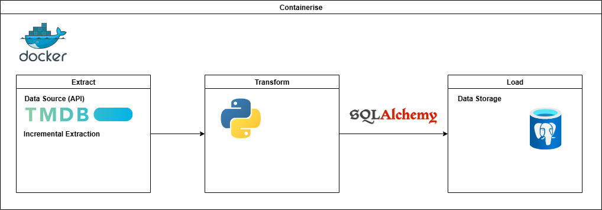

 Project plan

## Objective

> The objective of my project is to provide an analytical dataset from The Movie Database API.

## Consumers

What users would find your data useful? How do they want to access the data?

> The users of the dataset are Data Analysts who are interested in upcoming and the latest movie releases.

## Questions

What questions are you trying to answer with your data? How will your data support your users?

> - What are the highest rated recent film releases?
> - What movies are currently in cinemas for a specific genre I like?
> - What is the most popular movie in cinemas currently?
> - What upcoming movie releases are there?

## Source datasets

| Source name | Source type | Source documentation | Update frequency | 
| - | - | - | - | 
| The Movie Database | REST API | [Documentation](https://developer.themoviedb.org/docs/getting-started) | Every 8 hours

## Solution architecture

## Breakdown of tasks

As I am completing the project individually there will be no breakdown of tasks.
